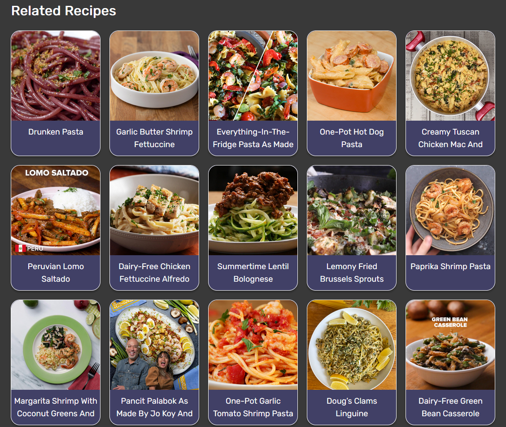

# Zest - web app

Zest is a web app that lets users find and sort recipes.

## Table of Contents

- [Project Description](#project-description)
- [Major Functions and Features](#major-functions-and-features)
- [Dependencies](#dependencies)
- [Project setup](#project-setup)
- [Usage](#usage)
- [Deployment](#deployment)

## Project Description

Zest is a web app that lets users find and sort recipes. It uses the Tasty API and features a modern design which is light, fully responsive and accessible. By default users can browse an entire page of recipes. Users can search for recipes by their ingredients (such as *cheese*). 

## Major Functions and Features

1. **Browse recipes:** The landing page features a list of recipe cards, which contain information about ingredients, cooking times and step-by-step directions. Each of the recipes contains a picture of the dish and a nutritional chart. The recipes displayed are fetched using the Tasty API.

2. **Find recipes:** By interacting with the search bar, the user can look for recipes entering an ingredient (such as *butter*, *chicken* or *carrot*). The results show up on the main page when the user use the search bar.

3. **Responsive design:** The website is made fully responsive on all viewports using flex and media queries, and it features cards in a layout of 5 to 1 columns.

4. **Dark mode:** There is an integrated dark mode for accessibility, which can be switched to using a toggle on the top right corner of the website. The website colors pass the AAA test on the Web Accessibility Guidelines, and they are both legible and easy on the eyes.

---

## Dependencies

To run "Zest" you will need the following dependencies and libraries:

- [React](https://react.dev/learn)
- [React Router](https://reactrouter.com/en/main)
- [Redux Store](https://redux.js.org/api/store)
- [Axios](https://axios-http.com/docs/intro)
- [Vite](https://vitejs.dev/guide/)
- [Tasty API](https://rapidapi.com/apidojo/api/tasty)

## Project setup

```
npm install
```

### Compiles and hot-reloads for development

```
npm run dev
```

### Compiles and minifies for production

```
npm run build
```

## Usage

Follow the steps below to effectively use "Zest" and accomplish tasks in the app:

1. **Installation:**

   Before getting started, ensure you have Node.js and npm (Node Package Manager) installed on your system.

   ```
   npm install
   ```

2. **Running the App:**

   To run the app locally in development mode, use the following command:

   ```
   npm run dev
   ```

   This will start a development server, and you can access the app by visiting the specified URL in your web browser.

## Deployment

- Preview link
https://main--chingu-voyage-v46-tier-2-team-16.netlify.app/

- Screenshot of the project


